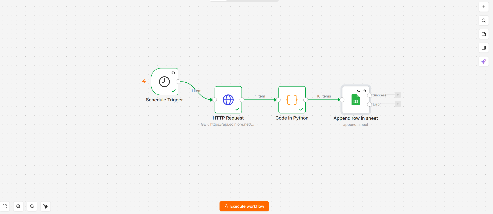
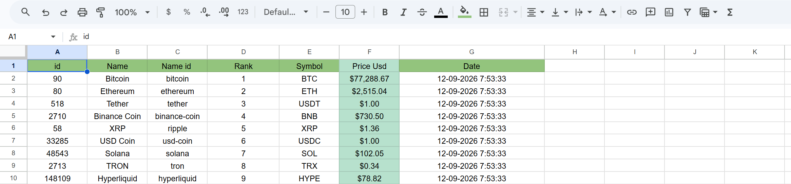

# 🪙 n8n Crypto Currency Data Pipeline

An automated data pipeline built in **n8n** that periodically fetches real-time market data for top cryptocurrencies, cleans and formats the prices using embedded **Python**, and securely logs the records into **Google Sheets** with precise timestamps.

## 🚀 Features
* **Automated Scheduling:** Uses the n8n Schedule Trigger to run hourly checks on cryptocurrency market updates.
* **Live API Integration:** Connects seamlessly with the CoinLore Tickers API to pull live pricing, ranks, symbols, and market data.
* **Native Python Data Processing:** Utilizes n8n's Python Code Node to parse JSON arrays, round off USD prices, and structure clean data objects without external dependencies.
* **Google Sheets Logging:** Automatically appends fresh market records along with a localized timestamp (`Asia/Karachi`) for historical price tracking.

## 📊 Workflow Architecture & Visuals

### 1. The n8n Workflow Design
The automated pipeline orchestrating the schedule trigger, API request, Python processing, and Google Sheets integration.

### 2. Google Sheets Output Data
The structured and formatted live data logged directly into Google Sheets.

## 🛠️ Tech Stack
* **Automation Engine:** n8n (Self-hosted / Docker)
* **Scripting Language:** Python (n8n Code Node)
* **Data Sink:** Google Sheets API (Service Account Authentication)
* **API Used:** CoinLore Tickers API

## ⚙️ How to Use This Workflow
1. Download the `Week 18 Building a Data Pipeline.json` file from this repository.
2. Open your n8n instance and import the workflow file.
3. Configure your **Google Sheets Credentials** (Service Account) in the *Append row in sheet* node.
4. Link your target Google Sheet document and sheet name where data should be appended.
5. Activate the **Schedule Trigger** to start tracking cryptocurrency prices automatically!

---
**Developed by [Hafiz Abu Bakar Siddique](https://github.com/hafizabubakar-dev)**  
*Automation Workflow Developer | n8n & Python*
